# Overview

Lab involves implementing a zero-trust architecture for service-to-service workloads on AWS using Amazon Verified Access (AVA), Amazon Verified Permissions (AVP), and AWS WAF. The lab covers how to securely integrate services across VPCs using Amazon VPC Lattice, and add edge security controls using AWS WAF. We will be using these services to build a modern serverless architecture using Amazon API Gateway, AWS Lambda, and Amazon DynamoDB.

---

# Activity 1

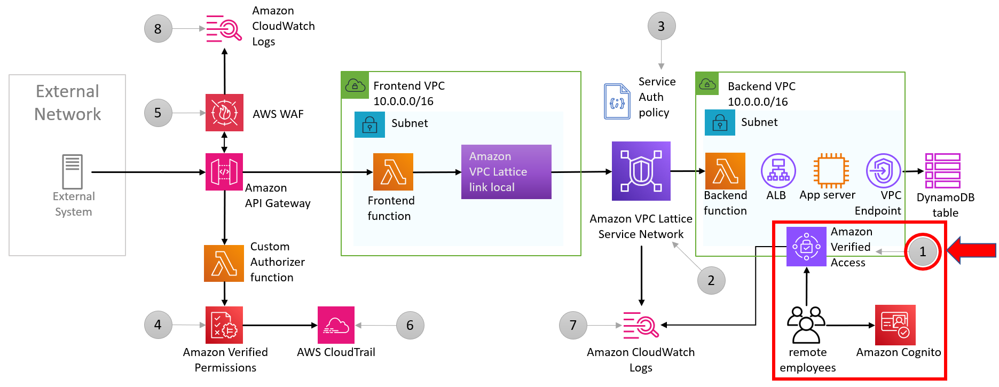

## Establish Secure Access to an Internal Web Application

### Configure AWS Verified Access logging

1. Open the AWS Verified Access console.
2. Navigate to the VPC console.
3. Scroll down to the AWS Verified Access section.
4. Click the Verified Access instances link under the "AWS Verified Access" section.
5. Click on the AVA instance ID that was created for you.
6. Select the Verified Access instance logging configuration tab.
7. Enable logging by checking the "Deliver to Amazon CloudWatch Logs" box.
8. Set the log group to /workshop/ava-instance-logs.
9. Click "Modify configurations".

### Evaluate configuration

Review the AWS Verified Access trust provider, group, and endpoint configuration.

1. Go to the VPC console.
2. Scroll down to the AWS Verified Access section.
3. Click "Verified Access trust providers".
4. Review the trust provider configuration.
5. Click on the ID associated with the Verified Access group.
6. Review the policy document.
7. Click "Verified Access endpoints".
8. Click on the ID associated with the Verified Access endpoint.
9. Review the endpoint configuration and the application domain.

### Create and log in as a user

Create user in Cognito and log in

1. Open a new incognito window.
2. Navigate to the login page: `https://admin-app.password123.sec302.reinvent2023.aws.demo.expert`
3. Click the "Sign up" link to create a new user in Cognito.
4. Fill out the form with a working email address, full name, and password.
5. Follow the instructions in the confirmation email to confirm the new user.
6. Log in with the new user.

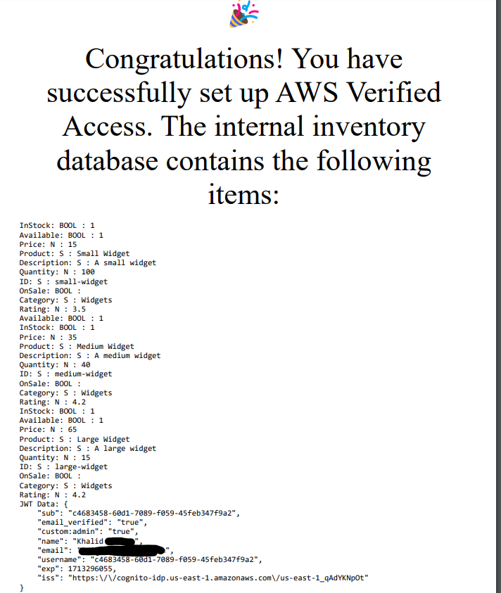

# Activity 2

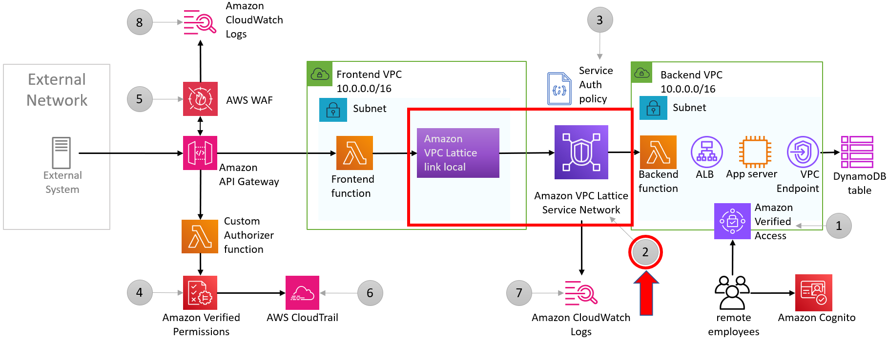

## Use Amazon VPC Lattice to Connect Frontend and Backend Applications

### Create a Service Network, Target Group, and Service for the Backend API

1. In the VPC console, navigate to the VPC Lattice section.
2. Click on "Services" in the left-hand navigation bar.
3. Click on "Create service" to create a new service.
4. For "Service name", enter "inventoryapi".
5. For "Description", enter "API providing inventory of products in stock".
6. Under "Monitoring", enable "Access logs" and select "/workshop/vpc-lattice" as the log group.
7. Click "Next" to go to the service details section.
8. Click "Create" to create the service.
9. Wait for the service to become active.
10. Click on the name of the service to view its details.
11. Copy the "Domain name" as we will use it in the next section.
12. Go back to the VPC console and navigate to the "Parameter Store" section.
13. Click on "/workshop/vpc-lattice-service" in the left-hand navigation bar.
14. Click on "Edit" next to "Lattice" in the parameter list.
15. For "Value", paste the "Domain name" of the "inventoryapi" service.
16. Click "Save changes".
17. The "inventoryapi" service is now integrated with the frontend.

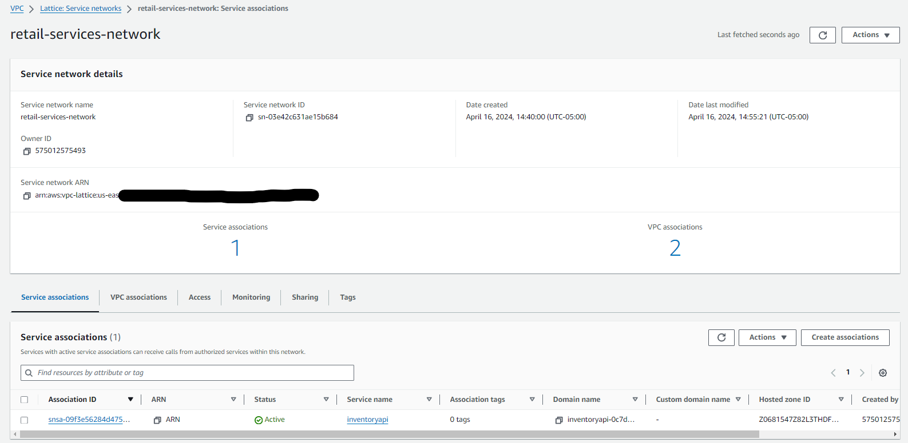
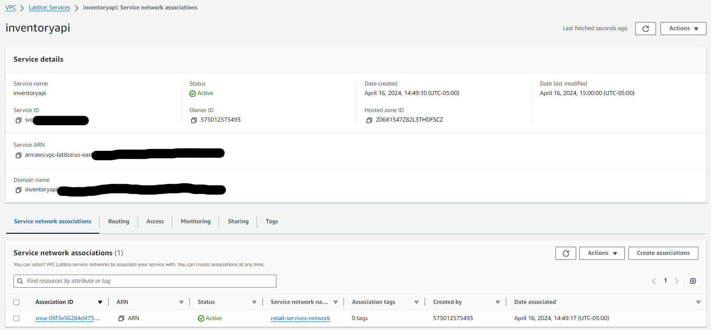

# Activity 3

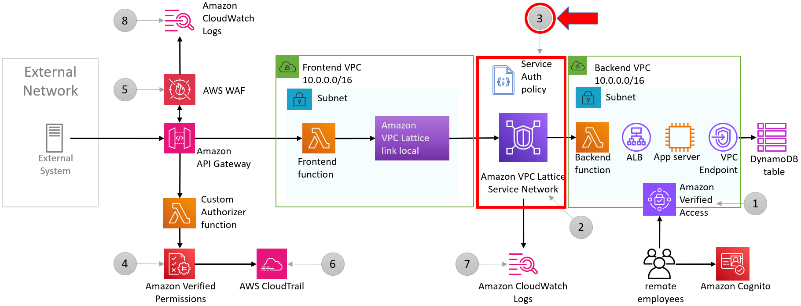

## Apply Auth Policies to Control Access to the inventoryapi Service

### Create Service Network and Service Auth Policies

#### Service Network Auth Policy Steps

1. Navigate to the VPC console.
2. Click on Service networks in the left side.
3. Click into "retail-services-network".
4. Switch to Access tab.
5. Click on Edit access settings.
6. Set auth type to "AWS IAM".
7. Apply policy template "Allow only authenticated access".

#### Service Auth Policy Steps

1. Copy the ARN of the Frontend Lambda function from the CloudFormation stack's output "A3xFrontendRoleARN".
2. Navigate to the VPC console.
3. Click on Services in the left side navigation.
4. Click into "inventoryapi".
5. Switch to Access tab.
6. Click on Edit access settings.
7. Set auth type to "AWS IAM".
8. Copy in the provided auth policy.

```json
{
  "Version": "2012-10-17",
  "Statement": [
    {
      "Effect": "Allow",
      "Principal": {
        "AWS": "arn:aws:iam::legend:role/workshop-studio-template-FrontendRole815EA6D6-FTbu26yhBpcZ"
      },
      "Action": "vpc-lattice-svcs:Invoke",
      "Resource": "*",
      "Condition": {
        "StringEquals": {
          "vpc-lattice-svcs:RequestMethod": "GET"
        }
      }
    }
  ]
}
```

# Activity 4

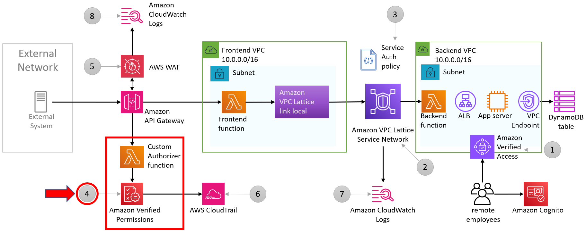

## Configure Amazon Verified Permissions (AVP) Schema and Policy for Inventory API Access

### Create AVP Policy Store, Schema, and Policy

## Create policy store

To set up an AVP policy store, follow these steps:

1. Navigate to the Amazon Verified Permissions console.
2. Click on **Create policy store**.
3. Choose **Guided setup** and click **Next** to proceed to step 2.

### AVP Guided Setup Step 1

On step 2, define the resource type:

1. Enter **Name of the resource type**: `InventoryData`
2. Remove `Update` and `Delete` actions
3. Click **Next** to proceed to step 3.

### AVP Guided Setup Step 2

On step 3, define the principal type:

1. For **Identity source** select **Custom**
2. Click **Next** to proceed to step 4.

### AVP Guided Setup Step 3

On step 4, define the first permissions policy, which requires an extensive configuration:

1. Under **Policy details**, you can enter **Policy description** (optional): `Allow specific supplier access to inventory data`
2. Under **Policy scope** > **Principals scope**, select **Specific principal**
3. For **Principal that will be permitted to take actions**, select **Supplier**
4. Specify **entity identifier**: `Widget-Supplies`
5. Under **Resources scope**, select **Specific resource**
6. For **Resource this policy should apply to**, select `InventoryData`
7. Specify **entity identifier**:

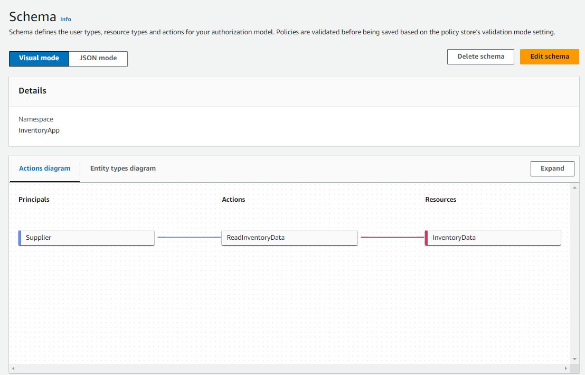

# Activity 5

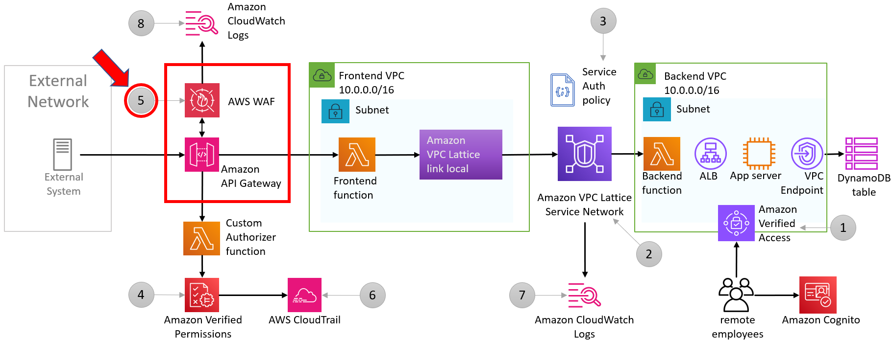

## Implement Edge Protection for API with AWS WAF

To protect your API from common threats like bot traffic and cross-site scripting (XSS), use AWS WAF with managed rules.

### Enable WAF for API Gateway

1. Navigate to the API Gateway console.
2. In the left-hand navigation, click on **APIs**.
3. Click on the name of the API you want to secure, for example `ExternalAPI`.
4. Click on the **Settings** tab.
5. Under **Security**, click **Enable WAF**.

#### Instructions

Review the AWS Web ACL that is already configured for your web application. Add a few common managed rule groups to the WebACL (list below). Enable logging to CloudWatch Logs to aid in future incident response procedures. Finally, associate the Web ACL with the Frontend API to apply protections.

Managed rule groups to add:

- Amazon IP reputation list
- Core rule set
- Known bad inputs

#### Procedure

1. Navigate to the WAF Web ACL and its Rules tab.
2. Add AWS-managed WAF rule groups.
3. In the Rules tab, click on Add Rules and select Add managed rule groups from the dropdown list.
4. Select the Free rule groups.
5. Toggle the switch for the following rule groups:
   - Amazon IP reputation list
   - Core rule set
   - Known bad inputs
6. Click on Add rules on the bottom of the page.
7. On the Set rule priority page, click on Save WAF rules priority.
8. Verify that these three rule groups are now listed in the Rules tab.
9. Enable logging for the AWS WAF Web ACL.
10. In the Logging and metrics tab, select Enable and select the CloudWatch Logs log group prefixed with `aws-waf-workshop`.
11. Click on Save.
12. Associate AWS WAF Web ACL with the API.
13. In the Associated AWS resources tab, click on Add AWS resources.
14. Select the Amazon API Gateway REST API resource type.
15. Name: FrontendAPIGateway - api.
16. Click on Add.
17. Verify that the Associated AWS resources list now contains FrontendAPIGateway - api.
18. You have successfully completed the association of the AWS WAF Web ACL with the resources you need to protect.

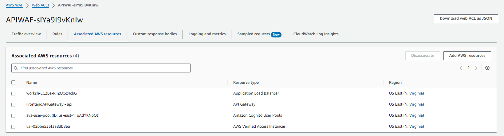

# Dashboard

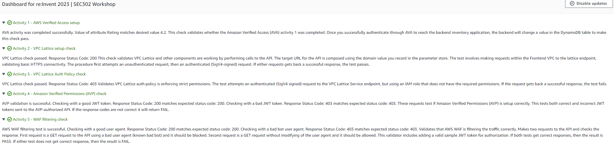
